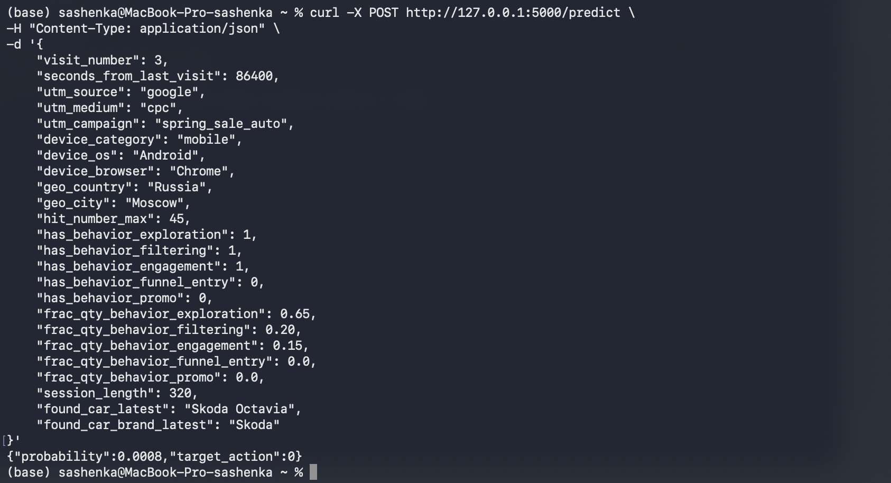

# Инструкция по использованию API
1) Установка библиотек
pip install flask pandas catboost
2) Разместите файлы с приложением (app.py) в одной директории вместе с предобученной моделью catboost_model.cbm
3) Запуск через командную строку python app.py -> в результате поднимется сервер
4) Теперь можно открыть другое окно в терминале и подать команду на локальный сервер вида
curl -X POST http://127.0.0.1:5000/predict \
-H "Content-Type: application/json" \
-d '{
    "visit_number": 3,
    "seconds_from_last_visit": 86400,
    "utm_source": "google",
    "utm_medium": "cpc",
    "utm_campaign": "spring_sale_auto",
    "device_category": "mobile",
    "device_os": "Android",
    "device_browser": "Chrome",
    "geo_country": "Russia",
    "geo_city": "Moscow",
    "hit_number_max": 45,
    "has_behavior_exploration": 1,
    "has_behavior_filtering": 1,
    "has_behavior_engagement": 1,
    "has_behavior_funnel_entry": 0,
    "has_behavior_promo": 0,
    "frac_qty_behavior_exploration": 0.65,
    "frac_qty_behavior_filtering": 0.20,
    "frac_qty_behavior_engagement": 0.15,
    "frac_qty_behavior_funnel_entry": 0.0,
    "frac_qty_behavior_promo": 0.0,
    "session_length": 320,
    "found_car_latest": "Skoda Octavia",
    "found_car_brand_latest": "Skoda"
}'
с упакованным в JSON формат информацией о визите пользователя
5) В результате в терминале появится ответ вида {"Probability": 0.49, "target_action": 0} с вероятностью положительной конверсии в целевое действие и ответ модели на вопрос - было ли в рамках заданной сессии целевое действие

**Превью sber_proj.ipynb недоступно в github можно перейти по ссылке на [nbviewer](https://nbviewer.org/github/anovokreschennykh1/sber_auto_cr_project/blob/main/sber_proj.ipynb) где все графики и код будет сразу перед глазами**

